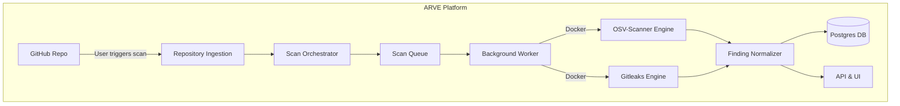
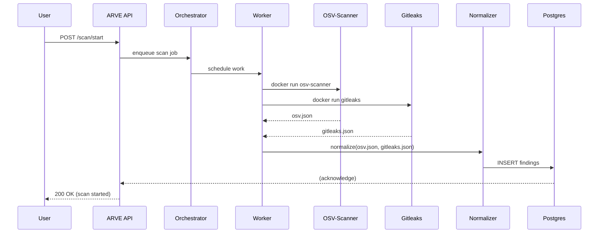

# Executive Summary

Phase 4A of ARVE adds **two new scanning engines (OSV-Scanner and Gitleaks)** and a **finding normalization layer**. We propose implementing each engine as a Docker-based `ScannerEngine` that runs via the existing scan orchestrator, then unifying outputs into a common `NormalizedFinding` schema. Both OSV-Scanner and Gitleaks are open-source, self-hostable tools with **no per-scan fees** (Apache-2.0 and MIT licenses, respectively), so they can run in ARVE’s backend without incurring vendor costs. We will **invoke OSV-Scanner and Gitleaks via Docker**, capturing their JSON/SARIF outputs into artifact files (e.g. `osv.json`, `gitleaks.json`). A normalization service will parse these into the ARVE database. 

The implementation will consist of *concrete tasks* such as creating `OsvScannerEngine` and `GitleaksEngine` classes (e.g. `backend/scanner/engines/osv.py` and `gitleaks.py`), defining their command invocations, handling I/O timeouts, and writing database DDL for findings. We include detailed tables mapping each engine’s output fields to our normalized schema, plus sample repositories (with known vulnerable packages and dummy secrets) to validate end-to-end. Finally, we cover deployment considerations: running scans in a dedicated worker (e.g. on Render rather than Vercel), offline OSV databases for rate-limit safety, and the legal/licensing limits for Semgrep/CodeQL (which remain optional extras, not core ARVE features). 

**Deliverables:** We will produce a step-by-step implementation plan (with file names, interfaces, Docker commands, etc.), database schemas, test-case specs, developer task breakdown, Mermaid diagrams (architecture and workflow), and example CI/CD snippets. 

## Engine Comparison

| **Engine**         | **Purpose**                            | **Invocation (Docker)**                                                                                                                                                                                            | **Output**      | **License & Limits**                                                                                                             |
|--------------------|----------------------------------------|--------------------------------------------------------------------------------------------------------------------------------------------------------------------------------------------------------------------|-----------------|----------------------------------------------------------------------------------------------------------------------------------|
| **OSV-Scanner**    | Dependency vulnerability scanner       | `docker run -v $WORKSPACE:/src ghcr.io/google/osv-scanner:latest scan source -r /src --format json` (or `--format sarif` if needed)                                                      | `osv.json` (JSON or SARIF) | Apache-2.0 (free). Can run offline with local OSV DB. No per-scan fees.                                      |
| **Gitleaks (v8.x)**| Secret detection (hardcoded secrets)   | `docker run -v $WORKSPACE:/path ghcr.io/gitleaks/gitleaks:latest dir /path --report-format json --report-path /path/gitleaks.json`                                                  | `gitleaks.json` (JSON)    | MIT license (free). Must use CLI/container (avoid Gitleaks Action). No usage fees.                              |
| **Semgrep CE***    | Code-pattern SAST (future/optional)    | (Optional) Use `docker run -v $WORKSPACE:/src returntocorp/semgrep:latest semgrep scan --config <rules> /src` (only open-source rules; proprietary rules not allowed in SaaS)                       | SARIF/JSON      | LGPG2.1 (engine free) but rules under Semgrep Rules License (no SaaS use). *Not core to Phase4A.*                |
| **CodeQL CLI***    | Advanced data-flow analysis (future)   | (Optional) `docker run -v $WORKSPACE:/src ghcr.io/github/codeql-cli:latest codeql database create` etc. (requires full repo and build)                                                                                  | SARIF           | Free on public repos; **private or SaaS use requires GitHub Code Security license**. *Optional, see Deployment.* |

*We focus on **OSV-Scanner** and **Gitleaks** in Phase 4A. Semgrep CE and CodeQL are deferred/optional due to licensing constraints.*

## OSV-Scanner Integration

**OSV-Scanner v2.x** is an open-source (Apache-2.0) tool from Google. It scans a code directory for supported manifest/lockfiles and reports known vulnerabilities from the OSV database. 

**Implementation Tasks:**  
- **Engine Class:** Create `backend/scanner/engines/osv.py` with class `OsvScannerEngine(ScannerEngine)`.  
  - Implement interface methods: `name() -> "osv-scanner"`, `build_command(workspace_dir)`, and `parse_output(artifact_path)`.  
  - Example signature: 
    ```python
    def build_command(self, workspace: str, output_path: str) -> List[str]:
        return ["osv-scanner", "scan", "source", "-r", workspace, "--format", "json", "--output-file", output_path]
    ``` 
    (Use `--format json` for machine-readable output; `--output-file` can write to a file instead of stdout.)  
  - Configure DockerRunner to use image `ghcr.io/google/osv-scanner:latest`. (Alternatively, we can build from the [Dockerfile][28], but pulling the official GHCR image is simplest.)  
- **Docker Invocation:** In code, DockerRunner should run:
  ```sh
  docker run --rm -v $WORKSPACE:/src ghcr.io/google/osv-scanner:latest scan source -r /src --format json
  ```
  capturing `stdout` or writing to `$WORKSPACE/osv.json`. (We must mount the workspace as `/src` and run `osv-scanner` inside it.) See example usage.  
- **Resource Limits:** Set Docker CPU/memory/timeouts conservatively. OSV scans modest-sized repos quickly. For safety, limit to e.g. `--memory=1g` and a few minutes timeout.  
- **Security:** Mount workspace read-only if possible (`-v $WORKSPACE:/src:ro`) and do not grant network (except to fetch OSV DB if not offline). Consider using `--offline` mode to avoid external calls (see “Offline Scanning”).  
- **Output Artifact:** Save JSON to `osv.json`. Example JSON output has a top-level `"results"` array. Each entry includes `source.path`, `packages[{package{name,version}, vulnerabilities[{id, aliases}, groups]}]`.  

**Sample OSV Invocation:**  
```sh
docker run --rm -v $(pwd)/testrepo:/src ghcr.io/google/osv-scanner:latest scan source -r /src --format json > /tmp/osv.json
```
This mounts `testrepo` at `/src` and scans for deps, writing JSON to `osv.json`.  

**Expected OSV Output (truncated):** Each vulnerability in `osv.json` looks like:  
```json
{
  "results": [
    {
      "source": {"path": "/src/package-lock.json","type":"lockfile"},
      "packages": [
        {
          "package": {"name":"lodash","version":"4.17.19","ecosystem":"npm"},
          "vulnerabilities": [
            {"id":"GHSA-jp86-8pfp-h4wp","aliases":["CVE-2020-8203"], ...}
          ]
        }
      ]
    }
  ]
}
```  
OSV groups aliases (e.g. CVE, GHSA) and provides *all* details in `results`.  

**License:** Apache-2.0 (permissive, free use). OSV-Scanner has no usage fees or scan quotas, making it ideal for ARVE Phase 4A. (We can optionally download the OSV DB for offline use to avoid API limits.)

## Gitleaks Integration

**Gitleaks v8.x** is an MIT-licensed secret detection tool. It finds hardcoded credentials or keys in a git repository or directory. We will use the CLI in Docker (image `ghcr.io/gitleaks/gitleaks:latest`). 

**Implementation Tasks:**  
- **Engine Class:** Create `backend/scanner/engines/gitleaks.py` with `GitleaksEngine(ScannerEngine)`.  
  - Implement `name() -> "gitleaks"` and `build_command(workspace, output_path)`. For simplicity, use the `dir` command to scan the files (no git history needed).  
  - Example command structure: 
    ```python
    return ["gitleaks", "dir", workspace,
            "--report-format", "json", "--report-path", output_path,
            "--verbose"]
    ``` 
  - If scanning with Git history, one could use `["gitleaks", "git", "--repo-path", workspace, ...]`, but ARVE typically clones a snapshot.  
- **Docker Invocation:** Mount the workspace at `/path`. Example:
  ```sh
  docker run --rm -v $WORKSPACE:/path ghcr.io/gitleaks/gitleaks:latest dir /path \
    --report-path /path/gitleaks.json --report-format json
  ```
  This tells Gitleaks to write its JSON report to `/path/gitleaks.json`. For example, see the usage snippet.  
- **Resource Limits:** Gitleaks is fast on moderate repos. Set Docker timeouts (e.g. `--timeout 300` within Gitleaks or controlling Docker CPU).  
- **Security:** Run on code only. Mount code read-only (`-v $WORKSPACE:/path:ro`). Gitleaks needs no network.  
- **Output Artifact:** The JSON output (array of findings) will include fields like `Description`, `StartLine`, `EndLine`, `File`, `Match`, `RuleID`, `Fingerprint`. For each detected secret, e.g.:
  ```json
  [
    {
      "Description": "Hardcoded AWS secret",
      "StartLine": 10,
      "EndLine": 10,
      "File": "/path/config.py",
      "RuleID": "generic-api-key",
      "Fingerprint": "abcd1234efgh5678",
      "Match": "AWSKEY=...",
      "Line": "AWSKEY=AAAABBBBCCCC"
      // ... other fields ...
    }
  ]
  ```
  (Gitleaks’ built-in JSON includes fields as shown in the example template.)  

**Supported Formats:** Gitleaks supports JSON, CSV, JUnit, SARIF. We choose JSON for easy parsing (or SARIF if we want SARIF).  

**License:** MIT (free). Again, no per-scan cost. We use the CLI directly, **not** the Gitleaks GitHub Action or SaaS.  

## Finding Normalization

ARVE will convert raw engine outputs into a unified `NormalizedFinding` model. 

**Schema Definition:** Below is a proposed PostgreSQL DDL for `findings`:

```sql
CREATE TABLE findings (
  id UUID PRIMARY KEY,
  scan_id UUID NOT NULL REFERENCES scans(id),
  engine TEXT NOT NULL,           -- e.g. 'osv-scanner' or 'gitleaks'
  finding_type TEXT NOT NULL,     -- e.g. 'dependency' or 'secret'
  title TEXT,
  description TEXT,
  severity TEXT,                  -- e.g. 'HIGH','MEDIUM', etc.
  confidence TEXT,                -- if applicable
  file_path TEXT,                 -- relative path to repo file
  line_start INT,
  line_end INT,
  column_start INT,
  column_end INT,
  package_name TEXT,              -- for SCA findings
  package_version TEXT,
  dependency_scope TEXT,
  cve TEXT,                       -- e.g. 'CVE-2021-1234'
  ghsa TEXT,                      -- e.g. 'GHSA-xxxx'
  cwe TEXT,                       -- e.g. 'CWE-79'
  rule_id TEXT,                   -- e.g. 'generic-api-key' (for Gitleaks)
  fingerprint TEXT UNIQUE,        -- dedupe key
  raw JSONB,                      -- original raw finding data (optional)
  created_at TIMESTAMPTZ DEFAULT NOW()
);
```

Each field is nullable except key identifiers. The combination of `engine`, `finding_type`, `package_name+version+vuln_id`, or `file_path+fingerprint` will ensure uniqueness (handled by `fingerprint`). 

**Normalized Fields:**

| **Field**         | **Type**     | **Description**                                                       |
|-------------------|--------------|-----------------------------------------------------------------------|
| `id`              | UUID         | Primary key (generated).                                              |
| `scan_id`         | UUID (FK)    | ID of the scan execution (ties to repository and commit).            |
| `engine`          | text         | Engine name (e.g. "osv-scanner", "gitleaks").                         |
| `finding_type`    | text         | Category (e.g. "dependency", "secret").                               |
| `title`           | text         | Short title of finding (e.g. vuln ID or "Hardcoded Secret").          |
| `description`     | text         | Detailed description/message.                                         |
| `severity`        | text         | Severity (use OSV's CVSS or static e.g. "MEDIUM").                    |
| `confidence`      | text         | If applicable (often empty).                                          |
| `file_path`       | text         | Path of file containing the finding.                                  |
| `line_start/end`  | int          | Source code line range (if known).                                    |
| `column_start/end`| int          | Column range (if known).                                              |
| `package_name`    | text         | Dependency name (from OSV results).                                   |
| `package_version` | text         | Dependency version.                                                   |
| `dependency_scope`| text         | e.g. "runtime"/"development" (optional).                              |
| `cve`, `ghsa`, `cwe` | text/text/text | CVE or GHSA ID, and CWE if provided.                              |
| `rule_id`         | text         | Engine-specific rule ID (e.g. Gitleaks rule ID).                      |
| `fingerprint`     | text         | Deduplication fingerprint (engine+relevant identifiers).              |
| `raw`             | JSONB        | Raw engine output for this finding (optional).                        |
| `created_at`      | timestamp    | Timestamp recorded.                                                   |

**Mapping Rules:** We transform each engine’s output into the above schema as follows:

| **Engine Output**            | **Normalized Field Mapping**                       |
|------------------------------|----------------------------------------------------|
| **OSV-Scanner (`osv.json`)** | - `engine = 'osv-scanner'`<br>- `finding_type = 'dependency'`<br>- `package_name = <packages>.[].package.name`<br>- `package_version = <packages>.[].package.version`<br>- `description = concatenation of vuln summary (from advisory) or ID`<br>- `title = vulnerability ID` (e.g. `GHSA-c3h9-896r-86jm`)<br>- `severity = CVSS score or "HIGH"/"CRITICAL"`<br>- `file_path = source.path` (e.g. path of lockfile)<br>- `cve/ghsa = vuln.id` (and aliases)<br>- `cwe = if OSV has CWE in description (optional)`<br>- `fingerprint = SHA256(package_name + package_version + vuln.id)`<br>- `raw = original JSON snippet` |
| **Gitleaks (`gitleaks.json`)**| - `engine = 'gitleaks'`<br>- `finding_type = 'secret'`<br>- `title = description` or a fixed string like "Secret in code"<br>- `description = finding.Description` (e.g. rule description)<br>- `rule_id = finding.RuleID` (e.g. "generic-api-key")<br>- `file_path = finding.File` (relative path)<br>- `line_start = finding.StartLine`, `line_end = finding.EndLine`<br>- `severity = "MEDIUM"` (assign a default, as Gitleaks does not have severity) <br>- `fingerprint = finding.Fingerprint` (unique secret ID)<br>- (no package fields) <br>- `raw = finding` (full JSON) |

**Fingerprinting/Deduplication:**  
- For OSV findings, set `fingerprint = sha256(name + version + id)` so we detect repeats of the same vulnerable dependency (update if same vuln).  
- For Gitleaks, use the built-in `Fingerprint` field (stable per-secret). This prevents duplicate secret alerts across runs.  

## Testing and Validation

To ensure correctness, we will define **mock repositories** and **test cases** that ARVE can scan end-to-end:

1. **Repo A (Node.js with vulnerable deps):**  
   - *Contents:* `package.json` with `"lodash": "4.17.19"` (which has GHSA vulnerability), and `app.js` with arbitrary code.  
   - *Expected OSV Findings:* One finding: package `lodash@4.17.19`, with ID `GHSA-*` and a CVSS score. The normalized record should have `package_name='lodash'`, `package_version='4.17.19'`, `cve/GHSA` fields set to the vuln ID, and severity (e.g. "7.2"). PASS if ARVE reports that.  
   - *Expected Gitleaks Findings:* None (no secrets). PASS if gitleaks.json is empty or no normalized secret entries.  

2. **Repo B (Python with a hardcoded secret):**  
   - *Contents:* `requirements.txt` listing safe packages; `config.py` containing a line like `API_KEY="sk_live_abcdef123456"` (fake key); maybe an `.env` file with `DB_PASSWORD=passw0rd`.  
   - *Expected OSV Findings:* Likely none (no vulnerable packages). PASS if `osv.json` is empty or no findings.  
   - *Expected Gitleaks Findings:* Two findings: one for the AWS/Stripe key in `config.py` and one for the password in `.env`. Each normalized finding should have `finding_type='secret'`, correct `file_path`, and a non-empty `fingerprint`. PASS if ARVE reports both secrets (line numbers > 0).  

3. **Repo C (Mixed):**  
   - *Contents:* A Node app with a vulnerable dependency *and* a secret in code.  
   - *Expected:* Both an OSV finding and a Gitleaks finding. This tests that ARVE can handle multiple engines in one scan.  
   - *PASS Criteria:* OSV finding appears with correct normalized data; Gitleaks finding appears with correct normalized data.  

Each test run should verify: (a) the engine ran without error (exit code 0), (b) the artifacts (`osv.json`, `gitleaks.json`) exist and contain the expected entries, and (c) the normalized findings in the database or output API match expectations. For example, a CI job could run these scans via Docker and `jq` or `grep` to assert presence of known IDs, and fail if missing.  

## Integration Plan for Developers

We assume **two developers (Dev A and Dev B)** can work in parallel. An example task split:

| **Dev A Tasks (OSV + Core)**                               | **Dev B Tasks (Gitleaks + Normalization)**                                |
|-----------------------------------------------------------|---------------------------------------------------------------------------|
| - Set up `OsvScannerEngine` class (file: `osv.py`) and test its Docker invocation (using `docker_runner`).      | - Set up `GitleaksEngine` class (`gitleaks.py`) and test its Docker invocation. |
| - Write command builder (`build_command`) and ensure JSON output flows back into ARVE workspace.   | - Implement parsing of Gitleaks JSON into normalized form.                |
| - Define normalized schema (DDL) and create DB table for findings. Write migration SQL for Postgres.           | - Map Gitleaks output fields to `NormalizedFinding` fields (see mapping table above). |
| - Write the OSV-to-normalized parser: extract package, vuln ID, etc. Insert into DB.    | - Write Gitleaks-to-normalized parser: insert secrets into DB.           |
| - Unit-test OSV integration with a sample repo fixture (using `osv.json` samples).     | - Unit-test Gitleaks integration with sample secret files.              |
| - **Handoff:** Provide `/schema/` SQL and example normalized rows to Dev B.        | - After OSV parser is complete, add code to combine both engines' results into single scan. |
| - Review Gitleaks engine code for consistency (later).                               | - Review OSV engine code for consistency and error handling.           |

**Code Review Checklist:**  
- Each engine’s `build_command()` must match the Docker usage examples (with correct flags) and use the registered Docker image.  
- The `ScannerEngine` interface methods (`run()`, `parse_results()`, etc.) should be implemented correctly.  
- Ensure workspace cleaning and timeouts are handled (no leftover state).  
- Validate that `fingerprint` generation avoids collisions.  
- Confirm license URLs and version numbers in code comments.  
- Properly handle missing fields (e.g., no line numbers from OSV).  
- Include tests for erroneous inputs (e.g. unsupported lockfile).  
- Ensure no use of Semgrep/CodeQL code in Phase 4A commit.  

## Architecture & Workflow (Mermaid)


*Figure 1: ARVE Phase 4A architecture (GitHub ingestion, scan orchestrator, parallel engines, normalization, database).*


*Figure 2: Scan request workflow. The Worker runs both engines in parallel, then feeds results to the Normalizer and database.*

## Docker Commands and CI Snippets

Here are representative commands and a CI job snippet:

```sh
# Example Docker run for OSV-Scanner (in a CI/test script)
docker run --rm -v $(pwd)/repoA:/src ghcr.io/google/osv-scanner:latest \
  scan source -r /src --format json > repoA/osv.json

# Example Docker run for Gitleaks
docker run --rm -v $(pwd)/repoB:/path ghcr.io/gitleaks/gitleaks:latest \
  dir /path --report-path /path/gitleaks.json --report-format json
```

**Sample GitHub Actions job (pseudocode):**

```yaml
jobs:
  scan_test:
    runs-on: ubuntu-latest
    steps:
      - uses: actions/checkout@v3
      - name: Run OSV scanner on sample repo
        run: |
          docker pull ghcr.io/google/osv-scanner:latest
          docker run --rm -v $PWD/test/repo1:/src ghcr.io/google/osv-scanner:latest \
            scan source -r /src --format json > $PWD/test/repo1/osv.json
      - name: Run Gitleaks on sample repo
        run: |
          docker pull ghcr.io/gitleaks/gitleaks:latest
          docker run --rm -v $PWD/test/repo2:/path ghcr.io/gitleaks/gitleaks:latest \
            dir /path --report-path /path/gitleaks.json --report-format json
      - name: Validate findings
        run: |
          # Example check for expected CVE in osv.json
          grep -q "CVE-2021-1234" test/repo1/osv.json || (echo "OSV missing expected CVE" && exit 1)
          # Example check for a secret in gitleaks.json
          jq '.[] | select(.File=="config.py")' test/repo2/gitleaks.json > /dev/null
```

These examples show how the Docker commands are used in CI. The real CI would then call the normalization code and ensure that the database has the expected records.

## Deployment Considerations

- **Hosting:** The scanning **must not run on Vercel functions**, as they have strict time/CPU limits (max 60–300s) and no privileged Docker. Instead, use a backend platform (like **Render**, Heroku, or self-host) that can run Docker containers for workers. Render’s free tier offers 750h/month but may need upgrading for production.  
- **Resource Limits:** Ensure the worker has enough CPU/RAM for scanning (e.g. 2 CPUs, 4GB RAM as a baseline).  
- **Costs:** OSV-Scanner and Gitleaks themselves cost $0 per scan (no vendor charges). The main cost is cloud hosting. Mitigate API limits by using offline OSV database mode and by caching Docker images.  
- **Licensing Risks:**  
  - *OSV & Gitleaks:* Safe (Apache and MIT).  
  - *Semgrep (optional):* Community Edition engine is free (LGPL), but **Semgrep-maintained rules are not allowed in SaaS**. We recommend either writing our own rules or licensing from Semgrep before using their rules in ARVE SaaS.  
  - *CodeQL (optional):* CodeQL CLI is **free only for public repos**. Private repo scans require GitHub Code Security licenses. Running CodeQL in a hosted ARVE for arbitrary private repos would violate the terms. For ARVE’s initial phases, **treat CodeQL as an advanced add-on**, only run on public code or demonstration, not on private user repos without license.  
- **Security:** Treat all scanned repos as untrusted. Always run engines in isolated containers, clean up after use, and do not expose credentials. For OSV offline DB, download updates via a safe CI process, not from untrusted repos.

**Mitigations:** If licensing is a concern, ARVE can optionally disable Semgrep/CodeQL engines for SaaS mode or require users to supply a license key. For immediate Phase 4A scope, these engines are not required.

## Deliverables

1. **Code Files:** 
   - `backend/scanner/engines/osv.py` (implements OSV-Scanner engine)  
   - `backend/scanner/engines/gitleaks.py` (implements Gitleaks engine)  
   - `backend/scanner/docker_runner.py` (no change; uses new engines)  
   - `backend/db/ddl.sql` (Postgres schema for `findings` table)  
   - `backend/normalizer.py` (maps raw outputs to `NormalizedFinding` records)  

2. **Interfaces:**  
   - `ScannerEngine` methods: e.g. 
     ```python
     class ScannerEngine:
         def build_command(self, workspace: str, output_path: str) -> List[str]: ...
         def parse_results(self, output_path: str) -> List[NormalizedFinding]: ...
     ```  
   - Implement these in `OsvScannerEngine` and `GitleaksEngine`.

3. **Config:**  
   - Docker images: pinned to versions (e.g. `ghcr.io/google/osv-scanner:latest`, `ghcr.io/gitleaks/gitleaks:latest`).  
   - Timeouts and resource limits in orchestration config.  

4. **CI/Test Cases:**  
   - Scripts or GitHub Actions YAML that run the above test repos and validate outputs.  
   - Example: `test/osv_example/`, `test/gitleaks_example/` with expected output files.

5. **Documentation:**  
   - This report itself, with diagrams, tables, and citations for all choices.  
   - Inline code comments citing official docs where relevant (as above).

Following this plan will deliver a modular, extensible Phase 4A implementation that fits into ARVE’s future roadmap (allowing later addition of Semgrep/CodeQL, normalization, correlation, etc.), while minimizing licensing/cost risks and ensuring a smooth deployment.

**Sources:** Official docs and repos for OSV-Scanner, Gitleaks, Semgrep, and CodeQL, which informed this plan. Each directive above is grounded in these references.