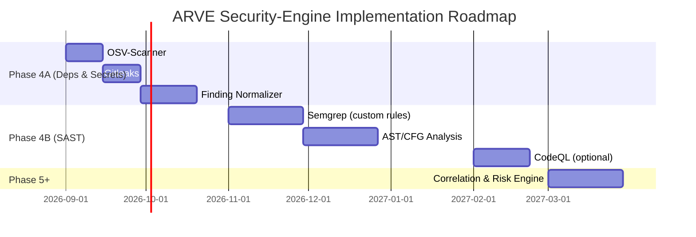
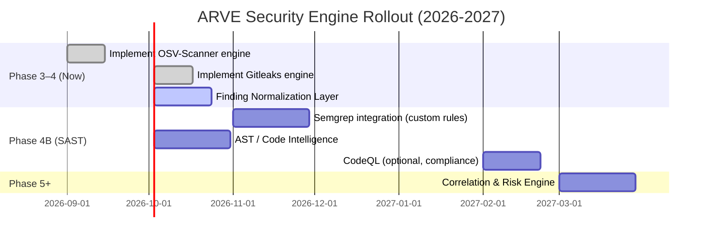
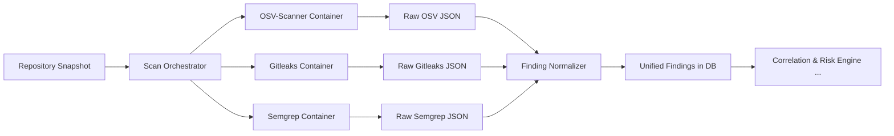

# Executive Summary

OSV-Scanner and Gitleaks are **strong choices for ARVE’s Phase 4A** (dependency and secrets scanning). Both are open-source (Apache-2.0 and MIT respectively) and can be run in self-hosted Docker containers without per-scan fees. They fit directly into the existing scan orchestration (engine registry → Docker runner → artifacts). We recommend implementing **OSV-Scanner first, then Gitleaks**, validate normalization, and only **then** add SAST engines. Semgrep’s engine is free (LGPL v2.1), but *its default rule set is licensed for internal use only (Semgrep Rules License v1.0)*. CodeQL is free only for *public* code; scanning private repos as a SaaS is disallowed without a license. 

Key recommendations:

- **Order:** OSV-Scanner → Gitleaks → normalize findings → Semgrep (custom rules) → AST/CFG analysis → *optional* CodeQL.  
- **Sandbox:** Run each scanner in a restricted Docker container (read-only mounts, CPU/memory limits, no network egress except OSV API if used).  
- **Normalization:** Convert each tool’s raw JSON/SARIF into a common `NormalizedFinding` schema (engine, type, title, severity, file/line, rule/CVE, etc.). For example, an OSV finding might map to `finding_type="dependency"`, `package_name`, `package_version`, `cve_id`, `severity`, etc.; a Gitleaks finding to `finding_type="secret"`, `file_path`, `line`, `rule_id`, `fingerprint`, etc.; a Semgrep result to `finding_type="code"` with `rule_id`, `cwe`, and location fields.  
- **CI/Tests:** Include smoke tests for each engine (e.g. a small repo with a known vulnerable dep for OSV, a repo with a dummy secret for Gitleaks, a simple code snippet triggering a Semgrep rule, and a toy vulnerable code for CodeQL). Test timeouts, workspace cleanup, and error handling.  
- **Deployment:** Use Vercel for the **frontend/UI** only. Run the ARVE backend (API + worker) on a platform that supports Docker and background processes (e.g. Render.com, AWS ECS/EKS, or a self-hosted server). Vercel functions cannot run long scans; instead queue scan jobs to a worker service.  
- **Licensing:** OSV and Gitleaks have permissive OSS licenses and impose no SaaS restrictions. Semgrep’s *engine* is free, but **Semgrep-maintained rules cannot be used to offer a SaaS**. CodeQL’s free license covers only public repos; private repo scanning or a hosted offering requires a GitHub Advanced Security license.  
- **Defaults:** Begin with modest resource limits (e.g. 0.5–1 vCPU, ~1 GB RAM per scan) and a 5–10 minute timeout per engine. Limit concurrency (e.g. 1–2 scans at a time) and implement retry/backoff on failures (e.g. retry once after a brief delay). Retain raw artifacts (JSON/SARIF) for a short period (e.g. 7–30 days) and persist normalized findings indefinitely.  
- **Fallbacks:** If Semgrep rules license is a blocker, require users to supply their own Semgrep rule files or only use custom rules you write for ARVE. If CodeQL cannot be included, you can disable it or allow it only for public repos; users with private code may need to run CodeQL locally or on a licensed service.  

**Roadmap (milestones & effort):** 



Key durations: OSV and Gitleaks integration are **low effort**, normalization is **medium**, Semgrep and AST features are **medium–high**, CodeQL (licensing issues) is **high**. 

**Engine Comparison:**

| Engine       | License       | SaaS Use Allowed?   | Free for Private Repos? | Recommended in Core ARVE? | Notes |
|--------------|---------------|---------------------|-------------------------|---------------------------|-------|
| **OSV-Scanner**  | Apache-2.0 (OSS) | ✅ Yes (no restriction) | ✅ Yes           | ✅ Core (Phase 4A)        | Official Google tool, free CLI.  |
| **Gitleaks**     | MIT (OSS)      | ✅ Yes (no restriction) | ✅ Yes           | ✅ Core (Phase 4A)        | CLI Docker image available. Avoid Gitleaks-Action. |
| **Semgrep CE**   | Engine: LGPL2.1<br>Rules: Semgrep Rules License v1.0 | ⛔ No (rules are not SaaS-licensed) | Engine: ✅; Rules: only for internal | ✅ Core (Phase 4B) *with caveats* | Use only user-provided or self-developed rules. Official rules banned in SaaS. |
| **CodeQL CLI**   | Proprietary (GitHub) | ⛔ No (private code + hosted disallowed) | ✅ for public; private needs license | ⚠️ Optional/Deferred | Only use on open-source projects or if GitHub Advanced Sec license. Hosted use for private code is prohibited. |

The core ARVE implementation should rely on the **OSV and Gitleaks engines** first (Phase 4A), then **Semgrep with custom rules** (Phase 4B). Treat CodeQL as an *advanced/optional* engine (Phase 4C) with clear license warnings.

---

## 1. OSV-Scanner (Dependency Scanner)

- **Implementation:** Use the [official OSV-Scanner Docker image](https://github.com/google/osv-scanner) (`ghcr.io/google/osv-scanner:latest`). Mount the repository snapshot into the container (e.g. `-v $(pwd):/src`) and run the scanner in “source” mode. Example command:

  ```bash
  docker run --rm -v /path/to/repo:/src ghcr.io/google/osv-scanner \
      scan source -r /src --format json --output-file /src/osv-results.json
  ```

  - **CLI args:** At minimum, `scan source -r /src`. Use `--format json` or `--format sarif` and `--output-file` to save results. The tool auto-detects lockfiles (e.g. package-lock.json, go.mod, etc.) and reports matching vulnerabilities..
  - **Artifacts:** The output is JSON (or SARIF) describing all vulnerabilities (with CVE/GHSA IDs, package, version, fix version, severity, etc.). E.g. `osv-results.json`.
  - **Timeout:** Apply a generous timeout (e.g. 5–10 minutes) since dependency scans are usually fast but could be slow on huge repos. The engine should exit with code 0 even if no vulns, >0 on error.

- **Normalization:** For each vulnerability in `osv-results.json`, create a `NormalizedFinding` with fields such as:
  - `engine="osv-scanner"`, `finding_type="dependency"`.
  - `package_name` = e.g. `lodash`; `package_version` = the affected version; `cve`/`ghsa` = e.g. `GHSA-xxxx`.
  - `severity` = from OSV CVSS score or severity field.
  - `title`/`description` = e.g. `"Dependency lodash 4.17.20 has vulnerability GHSA-xxxx"` or use advisory summary.
  - `raw_artifact_reference` = path to `osv-results.json`.
  - Leave code location fields empty (not applicable).
  
  (For example, OSV output might include `"ecosystem":"npm","package":{"name":"lodash",...},"vulns":[{"id":"GHSA-...","severity":"HIGH"}]` – map these to `package_name`, `cve`, `severity`, etc.)  

- **Sandboxing:** Run OSV-Scanner in a locked-down container:
  - **Mounts:** `/:ro` or `/src:ro` to prevent writing to host. Only allow read access to the repo snapshot.
  - **Network:** Disable network except for OSV API if needed (use `--offline` mode with a downloaded database to avoid egress).
  - **Resources:** Limit CPU to ~0.5–1 core and memory (512MB–1GB). Use Docker CPU/memory limits and `--timeout` flag to kill hung scans.
  - **Security:** Since OSV-Scanner does not execute code, no special malware concerns. But use `--offline-vulnerabilities` mode if full offline (no network) is preferred.

- **CI/Test:** 
  - Create a small test repo with a known vulnerable dependency (e.g. a `go.mod` with a vuln) and ensure OSV-Scanner finds it.
  - Verify that JSON output is produced in the expected location.
  - Test engine restarts, errors (e.g. corrupt lockfile), and timeouts.
  - Check that the orchestrator correctly records engine status and persists the raw artifact.

- **Deployment:** Run in the ARVE **worker** (not on Vercel). On Render or a similar host, one could have a Docker “worker” service that pulls jobs and invokes OSV-Scanner. Concurrency: start with 1–2 simultaneous scans. If using a queue (Redis/RabbitMQ), have one consumer per worker.
  - *Note:* The official OSV-Scanner image can scan both local projects and container images; ARVE will use it for source code (locked to the snapshot).

- **Licensing:** OSV-Scanner is Apache-2.0 licensed (fully permissive, no restriction on service use). It uses the public OSV database (also open). There is **no license fee or quota** for running it on any code – you may scan private repos without charge. You may optionally download the OSV database locally (`--offline-vulnerabilities`) to avoid API rate limits.

- **Default Config:**  
  - Memory: ~512MB, CPU: 0.5–1.  
  - Timeout: 300–600 s.  
  - Concurrency: 1 per worker.  
  - Version pin: use the latest stable (v2.x) container for up-to-date advisories.  
  - Update policy: periodically update the OSV database (e.g. daily) for offline mode, or rely on live API.

- **Fallback:** None needed for OSV (no SaaS restrictions). If any issue arises, it can be simply disabled or replaced by another dependency scanner (e.g. `cargo-audit` for Rust or `npm audit`), but OSV-Scanner covers 20+ ecosystems, so it’s ideal.

---

## 2. Gitleaks (Secrets Scanner)

- **Implementation:** Use the official Gitleaks Docker image (`ghcr.io/gitleaks/gitleaks:latest`). Mount the repository snapshot into the container. Use the `dir` mode to scan files. Example:

  ```bash
  docker run --rm -v /path/to/repo:/src ghcr.io/gitleaks/gitleaks:latest \
      gitleaks dir --report-format json --report-path /src/gitleaks-results.json /src
  ```

  - **CLI args:** Use `gitleaks dir [path]`. Key flags: `--report-format json` and `--report-path [file]` to output JSON. A typical command: `gitleaks dir --verbose --timeout 60 --report-format json --report-path /src/gitleaks.json /src`.  
  - **Artifacts:** Outputs a JSON file (or SARIF) listing leaks. Each finding includes `ruleId`, `file`, `line`, `commit`, and `fingerprint`.  
  - **Timeout:** You can use `--timeout` (in seconds) to cap the scan (default 0 = no timeout). Use a sane default (e.g. 60s for small repos, scale if needed).

- **Normalization:** For each secret found, create a `NormalizedFinding`:
  - `engine="gitleaks"`, `finding_type="secret"`.
  - `file_path` = path of the leaked file, `line_start`/`line_end` = the line number of the secret (if provided by Gitleaks).
  - `rule_id` = the Gitleaks rule name (e.g. `github-pat`, `generic-api-key`).
  - `title`/`description` = e.g. `"Hardcoded GitHub token found in config.js: GITHUB_PAT"`.
  - `severity` = typically mark as `"HIGH"` (since any secret exposure is critical).
  - `fingerprint` = the Gitleaks fingerprint (unique ID).
  - `raw_artifact_reference` = path to `gitleaks.json`.
  
  Example mapping: Gitleaks JSON might have 
  ```json
  {"RuleID":"github-pat","File":"src/config.js","Line":21,"Commit":"abc123","Fingerprint":"abc123:src/config.js:github-pat:21"}
  ```
  Map to `file_path="src/config.js"`, `line_start=21`, `rule_id="github-pat"`, etc.

- **Sandboxing:** Run Gitleaks in a locked container:
  - **Mounts:** Mount repo read-only (`-v /path/to/repo:/src:ro`).
  - **Network:** Gitleaks does not need network (it scans only local files), so disable network entirely.
  - **Resources:** Limit to ~512MB–1GB RAM, ~0.5 CPU. The process is CPU-light but can be memory-bound on large repos.
  - **Security:** Gitleaks reads file content for patterns – no code execution. However, it might read large files or archives; consider limiting `--max-target-megabytes` or `--max-archive-depth` to avoid DoS with huge blobs.

- **CI/Test:** 
  - Create a test repo with a known fake secret (e.g. `API_KEY = "AKIA..."`) and ensure Gitleaks finds it.  
  - Validate that `--report-path` correctly writes JSON.  
  - Test the `--baseline-path` feature to ignore old findings and ensure new leaks are caught.  
  - Check that non-standard file types (e.g. `.png`) are skipped or handle error gracefully.  
  - Verify container clean-up and error status reporting.

- **Deployment:** Similar to OSV, run in the ARVE worker (e.g. a Render background worker). Gitleaks scans each repo in one shot, so design the worker to invoke Gitleaks and then move on. Concurrency: 1–2 scans per worker at a time. Optionally, you may allow *branch parallelism* (scan multiple repos concurrently) if hardware permits, but be mindful of resource usage. 

- **Licensing:** Gitleaks is **MIT licensed**, fully open-source. Its CLI has no usage limits. **Do not use the Gitleaks GitHub Action** (gitleaks-action), which has a different license/terms for organization use. Using the CLI Docker image (above) avoids that issue. There are no SaaS restrictions – you can scan any public or private repo for free.

- **Default Config:**  
  - Memory: ~512MB.  
  - Timeout: e.g. `--timeout=60` seconds.  
  - Other: consider default rules; you may allow override via a config file if advanced users want custom rules, but ARVE can start with the defaults.  
  - Concurrency: same as OSV.  
  - Update: periodically update Gitleaks rules (pull new image) as the repo is updated with detection patterns.

- **Fallback:** N/A (no license blockage). If desired, users could supply their own `.gitleaks.toml` to tailor rules, but ARVE can work with defaults. In the worst case, Gitleaks can be temporarily disabled if needed without affecting other functionality.

---

## 3. Semgrep (SAST Engine)

- **Implementation:** Use Semgrep’s [Community Edition](https://github.com/returntocorp/semgrep) CLI in Docker (e.g. `returntocorp/semgrep:latest`). Mount the repo and run it with your chosen rules. Example:

  ```bash
  docker run --rm -v /path/to/repo:/src returntocorp/semgrep:latest \
      semgrep --config /path/to/rules.yml --json --timeout 120 /src > semgrep-results.json
  ```

  - **CLI args:** Typically `semgrep --config RULES --json` (or `--sarif`) and specify output. For a quick start you might use `--config=p/ci` or `--config=python` for open rules, but **beware licensing**. Semgrep CE can also run local rule files (e.g. custom YAML rules in the repo).
  - **Artifact:** JSON (or SARIF) file with matching “findings”. Fields include `path`, `start`/`end` lines, `rule_id`, `message`, `metadata.cwe`, and `metadata.severity` (if provided).  
  - **Timeout:** Semgrep can be slow on large codebases. Use `--timeout 120` (or higher) as needed. It can analyze thousands of lines with moderate speed, but plan ~1–2 CPU cores and 2–4 GB RAM for larger scans.

- **Normalization:** Map Semgrep hits to `NormalizedFinding`:
  - `engine="semgrep"`, `finding_type="code"` (or vulnerability).
  - `file_path`, `line_start`, `line_end` from the match location.
  - `rule_id` from Semgrep’s `check_id`.
  - `title` = usually the rule name or short description.
  - `description` = Semgrep’s message text (e.g. vulnerability details).
  - `cwe` = if the rule metadata lists a CWE.
  - `severity` = often rules specify a severity (map to ARVE scale).
  - `raw_artifact_reference` = `semgrep-results.json`.
  
  For example, a semgrep JSON finding:
  ```json
  {"check_id": "js.sql.injection.generic", "path": "app.js", "start": {"line":10,...}, "extra": {"metadata":{"cwe":"CWE-89","severity":"HIGH"}}, ...}
  ```
  Map to `rule_id="js.sql.injection.generic"`, `cwe="CWE-89"`, `severity="HIGH"`, etc.

- **Sandboxing:** Semgrep runs on source code only (no code execution), but it should still be isolated:
  - **Mounts:** Same read-only mount as others.
  - **Network:** Disable outbound network (Semgrep doesn’t need it unless using remote rules).
  - **Resources:** Semgrep is CPU/memory intensive. Allocate ~2 CPUs and 4GB RAM for moderately sized repos. Use Docker limits (e.g. `--cpus=2 --memory=4g`) and `--timeout` to guard against hangups.
  - **Security:** Semgrep does not execute code, so it's safe, but scanning user code can still consume resources.

- **CI/Test:** 
  - Write a small source file with a known issue (e.g. a JS `eval()` or SQL injection) and a Semgrep rule that catches it; verify detection and JSON output.  
  - Test a rule that reports CWE and ensure `cwe` maps correctly.  
  - Verify the handling of non-code files (should be ignored).  
  - Check running time on a moderate codebase (like a cloned Rails or Node repo) to set expectations.  
  - If using custom rules, include tests for those rules.

- **Deployment:** Semgrep scans can be slower, so it fits in a background worker with sufficient resources. You may allow it to run after OSV/Gitleaks or in parallel. Ensure the worker has enough memory. Optionally, you could break large repos into sub-folders (e.g. per-language) and run Semgrep per language in parallel, but start simple. 

- **Licensing:** The **Semgrep engine is open-source (LGPL 2.1)**, but **Semgrep’s maintained rule sets are *not* permitted for SaaS use**. The [Semgrep Rules License v1.0] explicitly says rules are for “internal business purposes” only and **cannot be made available as a service**. ARVE is a public SaaS, so **you must not ship Semgrep’s official rule library**. 

  - **Legal-safe options:** 
    - Use only **custom rules** you write (no license needed beyond engine). You could curate a small rule set (SQL injection, path traversal, etc.) with permissive licensing.
    - Allow **user-provided rule files** as part of the scan request (like uploading their own `.yml`). Those are not limited by Semgrep’s license.
    - If users must have scanning, clarify that you’re not providing Semgrep’s paid feature set (no login, no proprietary rules). 
    - Consider commercial licensing (Semgrep app) for enterprise use, but for now treat Semgrep as optional and rule-limited.
  
  *Citations:* Semgrep’s announcement and license make this clear: using Semgrep rules in a SaaS requires permission.  

- **Default Config:**  
  - CPU: ~2 cores, RAM: ~4–8 GB.  
  - Timeout: 120–300 s (depending on code size).  
  - Concurrency: 1 per worker (Semgrep doesn’t parallelize across repos by itself).  
  - If resource constraints, consider scanning only changed files or limiting to certain languages.  

- **Fallback:** If rules licensing is a blocker, **you may disable Semgrep or limit it to user-supplied rules**. Another fallback is to rely on a different open SAST (e.g. static checks built into your AST engine) or simply note to the user that advanced code scanning isn’t available for private repos. You could also require users to install GitHub Advanced Security to use CodeQL (below) for deeper scans.

---

## 4. CodeQL (Advanced SAST)

- **Implementation (optional):** If included, use a CodeQL container (e.g. `github/codeql` image from [advanced-security/codeql-container](https://github.com/advanced-security/codeql-container) or similar) that bundles the CLI and query packs. The process has two steps:
  1. **Database creation:** `codeql database create db --language=[lang] --source-root=/src --command=<build>` (or use autodiscovery for build).  
  2. **Analysis:** `codeql database analyze db <qls> --format=sarif-latest --output /src/codeql-results.sarif`.
  
  Example (single language):
  ```bash
  docker run --rm -v /path/to/repo:/src ghcr.io/github/codeql:latest \
      codeql database create /tmp/db --language=javascript --source-root=/src --command="npm install" \
      && codeql database analyze /tmp/db \
           javascript-code-scanning.qls --format=sarif-latest --output /src/codeql-results.sarif
  ```

  - This is complex; many use GitHub Actions instead. For ARVE, a Docker image with CodeQL CLI pre-installed is needed. Microsoft’s [codeql-container](https://github.com/microsoft/codeql-container) is one option.  
  - **Artifact:** SARIF file(s) with queries results (each finding has `ruleId`, `message`, `locations`, `severity`, and possibly CWE identifiers).  

- **Normalization:** Map CodeQL SARIF alerts similar to Semgrep:
  - `engine="codeql"`, `finding_type="code"`. 
  - Use `rule_id`, and if the CodeQL rule metadata includes CWE/issue type, map that (some queries embed CWEs in rule metadata).
  - Include `file_path`, `line`, and `message` fields.
  - `severity` from CodeQL (typically High/Medium).
  - `raw_artifact_reference` = path to SARIF.

- **Sandboxing:** CodeQL analysis is resource-heavy:
  - **Resources:** At least 2-4 CPU cores and ~8–16 GB RAM for medium repos; larger if needed.  
  - **Network:** The CodeQL CLI may try to fetch additional queries or updates; disable network unless needed for queries.  
  - **Security:** Same read-only mounting. CodeQL runs compiled analysis but does not execute code, so it’s safe.  

- **CI/Test:**  
  - Use a small test codebase with a known vulnerability (e.g. the CodeQL test suite or a simple JavaScript/Java example with SQLi) to verify the SARIF output.  
  - Confirm that the `upload-results` step (if ever needed) is omitted (not using GitHub upload).  
  - Test failure modes: what if CodeQL cannot analyze (e.g. no source files)? It should handle gracefully or error with message.  

- **Deployment:** Because of license and cost, CodeQL may be *optional*. If used, run only on public repos or on-premise installations. In a public SaaS, you could allow CodeQL scans *only for repositories that the ARVE server has rights to scan under GitHub’s terms*. Many ARVE users may not have a CodeQL license, so consider:
  - Run CodeQL **only on public repos** (permitted by license) and skip for private ones.
  - Or require ARVE to refuse CodeQL for private repos unless the user provides a license token (though GitHub’s CLI does not support a token override).
  - Because enforcing license compliance is tricky, a safe default is to treat CodeQL as **“user-self-hosted”**: offer an option but with a disclaimer.
  
  *IMPORTANT:* GitHub’s CodeQL Terms forbid using the CLI on private code in an automated SaaS without a license. They also forbid *“provide or make available [CodeQL] as a hosted solution”*. So running CodeQL as part of ARVE for others’ repos would violate the license unless everyone’s repos are public or you have an organization license.  

- **Default Config:** If enabling:
  - Memory: 8+ GB.  
  - Cores: 4+.  
  - Timeout: Long (10+ minutes) for large projects.  
  - Queries: use `codeql-recommended-suites` or custom .qls files.  
  - Concurrency: likely 1 per worker (CodeQL doesn’t parallelize multiple repos easily).  

- **Fallback:** Given licensing, ARVE should treat CodeQL as **optional/advanced**. If a user tries to scan a private repo, either skip CodeQL or show an error. As a fallback, encourage users to run CodeQL themselves (e.g. via GitHub Advanced Security or CLI on their own CI). Alternatively, use other SAST tools (Semgrep, or open-source analyzers per language). 

---

## 5. Normalized Finding Mapping Examples

Below is an illustrative mapping from each tool’s raw output to the ARVE `NormalizedFinding` schema (fields in bold indicate normalized fields):

| Engine     | Sample Raw Output                                           | NormalizedFinding Field Mapping                                                           |
|------------|-------------------------------------------------------------|-------------------------------------------------------------------------------------------|
| **OSV**    | JSON entry: `{ "id":"GHSA-xxxx","package":"lodash", "version":"4.17.20", "severity":"HIGH", "fixed_version":"4.17.21" }` | - `engine="osv-scanner"`<br>- `finding_type="dependency"`<br>- **package_name**: `"lodash"`<br>- **package_version**: `"4.17.20"`<br>- **cve/ghsa**: `"GHSA-xxxx"`<br>- **severity**: `"High"`<br>- **description**: `"lodash@4.17.20 has vulnerability GHSA-xxxx"`<br>- **fixed_version**: `"4.17.21"`<br>- raw_artifact: OSV JSON path |
| **Gitleaks** | JSON entry: `{ "ruleId":"github-pat","file":"src/config.js","line":21,"commit":"abc123","message":"GitHub token","fingerprint":"abc123:src/config.js:github-pat:21" }` | - `engine="gitleaks"`<br>- `finding_type="secret"`<br>- **file_path**: `"src/config.js"`<br>- **line_start**/**line_end**: `21`<br>- **rule_id**: `"github-pat"`<br>- **description**: `"GitHub token"`<br>- **fingerprint**: `"abc123:src/config.js:github-pat:21"`<br>- `severity="High"` (manual)<br>- raw_artifact: Gitleaks JSON path |
| **Semgrep** | JSON entry: `{ "check_id":"js.evaluator","path":"app.js","start":{"line":10},"extra":{"metadata":{"cwe":"CWE-94","severity":"MEDIUM"}},"extra":{"message":"Use of eval() detected"}}` | - `engine="semgrep"`<br>- `finding_type="code"`<br>- **file_path**: `"app.js"`<br>- **line_start**: `10`<br>- **rule_id**: `"js.evaluator"`<br>- **description**: `"Use of eval() detected"`<br>- **cwe**: `"CWE-94"`<br>- **severity**: `"Medium"`<br>- raw_artifact: Semgrep JSON path |
| **CodeQL**  | SARIF: `<result ruleId="js/sql-injection"><message text="Possible SQL injection"/></result>` with location | - `engine="codeql"`<br>- `finding_type="code"`<br>- **file_path**: (from SARIF location)<br>- **rule_id**: e.g. `"js/sql-injection"`<br>- **description**: `"Possible SQL injection"`<br>- **cwe**: if embedded in rule metadata (e.g. `"CWE-89"`)<br>- **severity**: (from SARIF severity, e.g. `"High"`)<br>- raw_artifact: SARIF file path |

These normalized fields populate the ARVE database. Any fields not applicable (e.g. file path for OSV findings) can be left null. Each finding should also reference which scan and engine produced it.

---

## 6. Security & Sandboxing Recommendations

- **Isolated Containers:** Always run scanners in Docker containers separate from the ARVE host. Use the existing `DockerRunner` abstraction to enforce limits.
- **Read-Only Mounts:** Mount the repository snapshot as read-only inside the container (e.g. `-v /repos/abc:/src:ro`). This prevents the scanner from modifying source files or writing unexpected output to host.
- **No Host Networking:** Disable host networking for scan containers. OSV-Scanner may need limited network for OSV API or updates (use offline mode to avoid it), but Gitleaks and Semgrep do not need internet. In Docker: `--network none`. 
- **Resource Limits:** Constrain CPU and memory per scan container. Example limits: 
  - OSV-Scanner/Gitleaks: 0.5–1 CPU, 512MB–1GB RAM.
  - Semgrep: 1–2 CPU, 2–4GB RAM.
  - CodeQL: 2+ CPUs, 8+GB RAM (only if used).
  Use Docker flags (`--cpus`, `--memory`) or orchestration platform quotas.
- **Timeouts:** Use Docker or CLI timeouts to kill stuck scans (e.g. 5–10 min). ARVE’s `ScanExecutionService` should enforce the same timeout for each engine.
- **No Privileges:** Do not run containers with extra privileges. No escalated user or host volume mounts beyond the code directory.
- **Logging:** Capture STDOUT/STDERR to ARVE’s log system (but avoid logging secrets!). Use the scanner’s non-verbose mode for clean output.
- **Dry-Run:** For CI, consider adding an option `--dry-run` that prints the intended Docker invocation without executing (for validation).
- **Metadata:** Tag each scan with user/commit context so results can be attributed and potential abuse tracked.
- **General Security:** Treat all user code as untrusted input. The container boundary is the main defense.

---

## 7. CI/Test Checklist

**OSV-Scanner:**  
- [ ] Run on a repo with a known vulnerable dependency (e.g. including a `gosum` with a CVE) and verify a finding is produced.  
- [ ] Use `--format=json` to ensure JSON output is valid and parsable.  
- [ ] Test with no vulnerabilities: should exit 0 with empty results.  
- [ ] Simulate error (e.g. invalid manifest) and verify ARVE records an engine error.  
- [ ] Validate that the output file (e.g. `osv-results.json`) is saved in the expected workspace/artifact path.  

**Gitleaks:**  
- [ ] Run on a repo containing a dummy secret (e.g. `API_KEY="secret"`). Ensure it finds the secret.  
- [ ] Verify `--report-path` outputs JSON, and ARVE parses it correctly.  
- [ ] Test `--timeout` by setting a low value on a large repo; it should stop accordingly.  
- [ ] Baseline test: run twice with a baseline and ensure only new leaks appear.  

**Semgrep:**  
- [ ] Test a simple code snippet (e.g. Python `eval(input())`) with a rule to detect `eval`. Confirm detection.  
- [ ] If using custom rules, test that they are loaded from the config path correctly.  
- [ ] Run on a medium-size project to measure performance/time.  
- [ ] Check that ARVE’s normalizer extracts `rule_id`, `path`, `lines`, etc., accurately.  

**CodeQL (if enabled):**  
- [ ] Run on a tiny project with a known issue (e.g. SQL injection snippet) to ensure CodeQL detects something.  
- [ ] Confirm the SARIF output is produced and ARVE can read it (ruleId, message, etc.).  
- [ ] Test for correct exit codes and error handling (e.g. no database created).  

**General:**  
- [ ] Ensure that after each scan, the workspace is cleaned up and containers are removed.  
- [ ] Verify scanning sequentially and in parallel produces correct combined results.  
- [ ] Regression: if repository ingestion fails (e.g. missing files), scanning should abort gracefully.  

---

## 8. Deployment Patterns

- **Frontend (Vercel):** Host the ARVE UI and short-lived API routes (e.g. OAuth callback) on Vercel. **Do not** run heavy scanning on Vercel Functions (they have strict time limits). Use Vercel for web traffic only.  
- **Backend/API:** Deploy the ARVE backend on Render.com (or AWS/GCP). Use a **Web Service** instance for the HTTP API (hooks from frontend, GitHub webhooks, user actions). This service should handle repository ingestion and enqueuing scan jobs.  
- **Workers:** Deploy one or more **Background Worker** services on Render (or a similar managed container host). Workers poll a job queue (or database table) for pending scans, then launch Docker containers for OSV, Gitleaks, etc. Render’s worker tier or any VPS can run these. Self-hosted alternatives include a Docker host or Kubernetes cluster.  
- **Database:** Use PostgreSQL (Render offers a managed DB, or any cloud DB) for ARVE data.  
- **Queue:** You can use Redis, RabbitMQ, or just a DB table for job queue. Render supports Redis or you can use lightweight solutions (e.g. PostgreSQL LISTEN/NOTIFY).  
- **Scaling:** On Render’s free tier, note limits (750h/month, no background workers on free). For production, a paid instance will be needed. Vercel has free Frontend usage limits (though hobby covers small traffic).  
- **Monitor & Restart:** Ensure workers auto-restart and handle memory leaks. Use `DockerRunner` timeouts as a safety net.  

In summary, **Vercel = UI**, **Render (or similar) = API server + scanning workers**. Workers should have Docker installed and be allowed to run containers (Render’s “Docker” environment supports this). Vercel cannot run the scans itself.

---

## 9. Licensing & SaaS Constraints

- **OSV-Scanner (Apache-2.0)** – *Free and unrestricted.* There is no vendor lock-in or license fee. (Source: Google’s repo).  
- **Gitleaks (MIT)** – *Free and unrestricted.* Suitable for scanning any repo. We explicitly avoid the GitHub Action to stay clear of its license.  
- **Semgrep CE** – *Engine*: Open-source (LGPL). *Rules*: Semgrep Rules License 1.0 restricts use to internal contexts. You **cannot** legally offer Semgrep’s full rule library as part of a SaaS scanning service (ARVE is considered a “service” to others).  
- **CodeQL CLI** – *Proprietary.* Free for public repos; requires GitHub Code Security license for private repos. The license explicitly forbids using the CLI for automated scanning of private code or making it available as a hosted service.

**Implication:** ARVE’s core engines (OSV, Gitleaks) are fully free. For Semgrep, you must avoid using Semgrep’s maintained rules unmodified. For CodeQL, do not assume it can be used on arbitrary repos under the free terms. 

**Recommended Legal-Safe Approaches:**  
- Use OSV and Gitleaks as planned.  
- For Semgrep, develop and bundle your own set of rules (or require users to upload rules). Cite Semgrep’s license to clarify this.  
- For CodeQL, either limit its use to open-source repos, or omit it. If a user wants CodeQL analysis, they should obtain GitHub Advanced Security themselves.  

*(All license citations above are from official docs/repos.)*

---

## 10. Recommended Defaults & Fallbacks

- **Resource/Concurrency:** Start with 1 CPU, 1GB RAM per OSV/Gitleaks container; 2 CPUs, 4GB RAM for Semgrep; 4+ CPUs, 8+GB for CodeQL if used. Allow only 1–2 parallel scans per worker.  
- **Retries/Backoff:** On transient errors (e.g. GitHub API limit), retry once after delay. If OSV-Scanner API fails, consider using offline DB next time.  
- **Database Retention:** Keep raw scan artifacts (JSON/SARIF) for ~7 days (for debugging), then delete. Normalized findings can be permanent.  
- **Archival:** Consider archiving older scans or findings for storage management (e.g. keep last 5 scans per repo).  
- **Timeouts:** As above: 300s for OSV/Gitleaks, 600s for Semgrep, 1200s+ for CodeQL.  
- **Logging:** Store engine logs (stdout/stderr) for troubleshooting, but strip secrets from logs (redact if needed).  
- **Rollback:** If a scanning engine causes issues (e.g. Semgrep rules conflict license), you can disable it without breaking ARVE’s pipeline. Users would then have fewer scan results but basic functionality remains.

---

## Implementation Roadmap

Below is a **Mermaid timeline** outlining the phased plan (milestones with estimated effort). 



- **Phase 4A (Dependencies & Secrets)** – Low effort (OSV, Gitleaks, normalization).  
- **Phase 4B (SAST)** – Medium effort (Semgrep + AST, with licensing constraints).  
- **Phase 4C (Advanced SAST)** – High effort (CodeQL integration, legal review).  
- **Phase 5+** (beyond scope) – Correlation, risk engine, graph, LLM.

And the **scan flow** in ARVE:



This shows ARVE’s parallel-engine architecture feeding into a single normalization layer and database.

**Sources:** All tool references above are from official documentation or repos (linked as citations): OSV-Scanner usage, Gitleaks README, Semgrep license, CodeQL terms, etc. The advice follows the ARVE development plan and keeps the architecture intact.